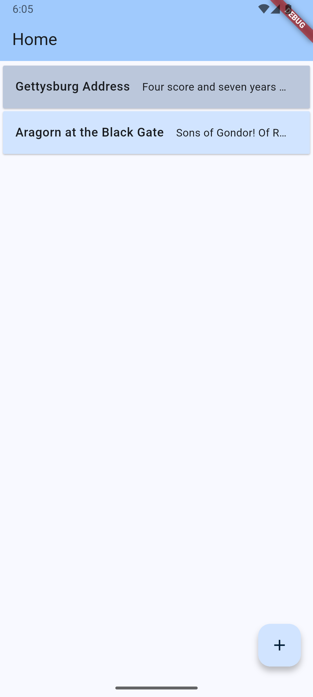
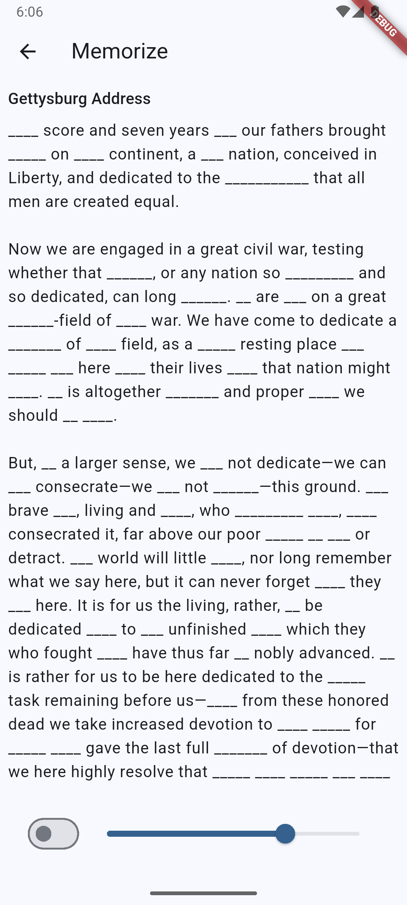
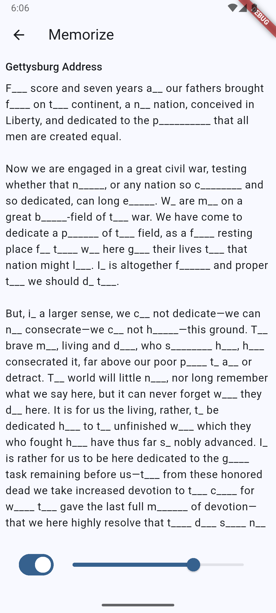

# memorize

This app is meant to help with memorizing passages of text.

It was also a fun experience to use the [Dart](https://dart.dev/) language and the [Flutter](https://flutter.dev/) framework to develop my first app.

There remains work to be done of course.
The architecture could probably be improved, though I tried to follow the [Model-View-ViewModel](https://en.wikipedia.org/wiki/Model%E2%80%93view%E2%80%93viewmodel) (MVVM) approach along with the [Flutter tutorial](https://docs.flutter.dev/get-started/fundamentals) and other resources.
I'd like to implement some network connectivity, such as backing up to Google Drive.
A (unit) testing suite would be a good idea.
And for now the app exists only here with a "debug" version on my phone; when I have some time to polish things up I'd like to get this onto Google Play.

## Screenshots

|   |   |   |
|---|---|---|
|  |  |  |
